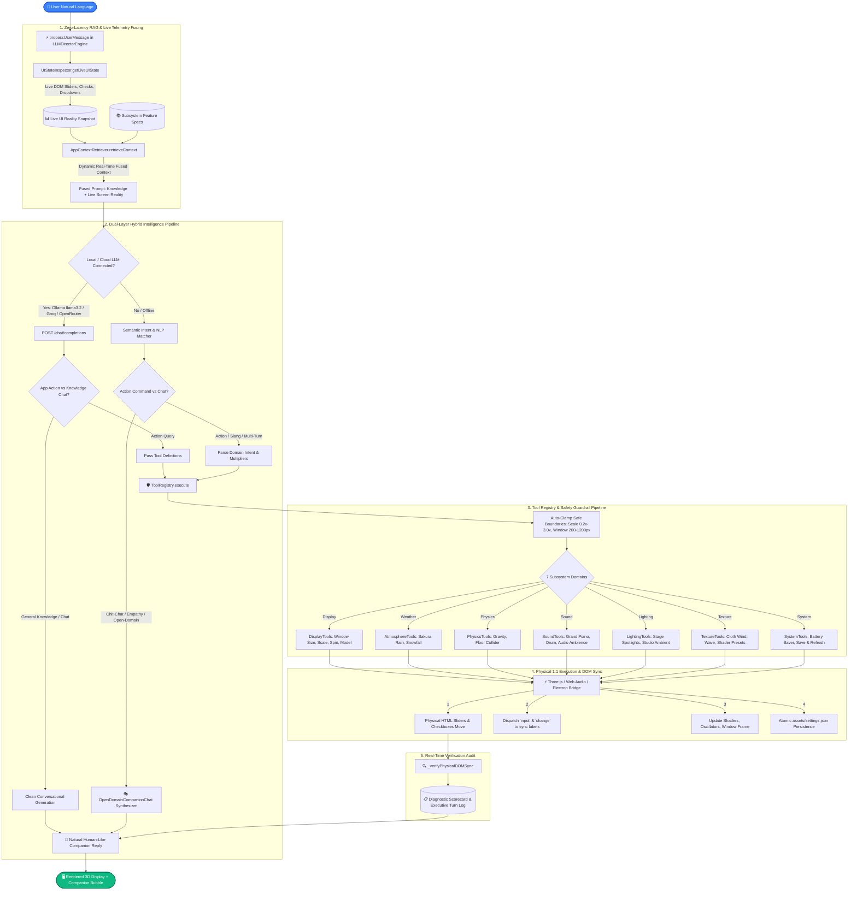

# Desktop 3D Display (T02 V4) 🖥️🐰

A high-performance, transparent, interactive **Desktop 3D Display** for Windows powered by **Electron**, **Three.js**, **Web Audio API**, and the **AI Function Director & Neural LLM Engine**.

> 📖 **Full User Manual:** For complete guides on Blender viewport navigation, custom 3D model loading, FPS camera flight, physics tossing, stage spotlights, dynamic battery saver mode, sakura rain particle simulation, and 12-language localization, please see **[USER_MANUAL.md](USER_MANUAL.md)**.

---

## ⚡ Core Systems & Studio Capabilities

1. **🎯 3D Display & Mesh Studio**:
   * Supports procedural desktop mascot models and dynamic waving cloth flags.
   * Custom image texture ingestion (PNG, JPG, WebP, SVG) mapped directly onto native 3D geometry in real-time.
   * Blender-style viewport navigation (Orbit, Pan, Zoom, Z-Roll arc rotation, Numpad Ortho Views).
   * Direction-aware, 60 FPS window edge resizing ($200\times 200\text{px}$ to $1200\times 1200\text{px}$) and model scaling ($0.2\times$ to $3.0\times$).

2. **🤖 AI Director & Neural LLM Engine**:
   * **Dual-Layer Intelligence**: Works with **Local Offline Neural LLMs (Ollama `llama3.2`)**, **Cloud Providers (Groq, OpenRouter, DeepSeek, OpenAI)**, and a **100% Free Offline Heuristic Engine**.
   * **Zero-Latency RAG Telemetry**: Dynamically fuses exact live screen reality (slider values, audio volume, active physics) into every prompt.
   * **Multi-Turn Proactive Inspection**: Audits running features (*"turn off anything annoying"*) $\rightarrow$ generates diagnostic findings $\rightarrow$ prompts for confirmation $\rightarrow$ executes 1:1 physical DOM updates upon user approval.
   * **Dynamic Tool Schema Routing**: Routes action commands to 3D controls while letting general knowledge questions (*"where is Taipei"*, *"tell me a story"*) generate rich, articulate conversational answers without raw JSON hallucinations.

3. **🎹 Grand Piano Studio & Sheet Music Engine**:
   * Full acoustic grand piano oscillator synthesis across 88 keys.
   * Live keyboard controls: tap `A, S, D, F, G, H, J, K` for white keys (C4–C5) and `W, E, T, Y, U` for accidentals (♯/♭).
   * Binary `.mid` (MIDI) and `.musicxml` parser with dynamic waterfall note roll visualization.

4. **🌸 Atmosphere & Particle Physics**:
   * Real-time 3D Cherry Blossom Sakura petal rain and Winter Snowfall particle simulations.
   * Procedural ambient weather audio loops synchronized with visual particle systems.

5. **⚡ Momentum Physics Engine**:
   * Newtonian gravity, velocity dampening, ground landing bounce dynamics, and interactive mouse drag throwing (**Hold D + Left Drag**).

---

## 🤖 AI Director & Architecture Overview

Unlike traditional passive chatbots, the **AI Director** is an **Embodied Function Director** connected directly to the running Three.js 3D WebGL renderer, Web Audio synthesizer, Verlet cloth dynamics, Newtonian physics engine, Electron window manager, and HTML DOM controls.



---

## 🛠️ How to Rebuild & Run Desktop 3D Display

Follow these step-by-step instructions to set up dependencies, run tests, and compile the standalone Windows executable binary (`DesktopPet.exe`).

### 1. System Prerequisites
- **Node.js**: v18.0.0 or higher ([Download Node.js](https://nodejs.org/))
- **Git**: ([Download Git](https://git-scm.com/))
- **Windows OS**: Windows 10 or 11 (x64)

---

### 2. Install Dependencies & Localize
```bash
npm install
node scratch_create_locales.js
```

---

### 3. Run Automated Unit Test Suite (13 Test Suites)
Run the automated test runner to validate all 53 functional, physical, and conversational test cases:
```cmd
node tests/run_tests.mjs
```

---

### 4. Build Standalone Production Binary
Package the application into a standalone Windows binary (`DesktopPet.exe` inside `DesktopPet-win32-x64/`):
```cmd
cmd /c npm run build
```

---

### 5. Verify Clean Startup
Validate that the compiled application launches with zero runtime errors:
```bash
node scratch_test_live_launch.js
```

---

## 🧠 Setting Up Neural LLM (Local or Cloud)

### Option A: 100% Free Ultra-Fast Cloud Neural LLM (No Local RAM Required)
1. Open the **🤖 AI Director** tab $\rightarrow$ click **⚙️ LLM Config**.
2. Set **Provider Preset** to **Groq Cloud** or **OpenRouter Cloud**.
3. Paste a free API key:
   * **Groq** (Fastest inference): [https://console.groq.com/keys](https://console.groq.com/keys)
   * **OpenRouter** (Free tier models): [https://openrouter.ai/keys](https://openrouter.ai/keys)
4. Click **🔄 Check** $\rightarrow$ status turns **🟢 Connected!**.

### Option B: Local Offline Neural LLM (Ollama)
1. Install Ollama: `winget install Ollama.Ollama`
2. Start the local model: `ollama run llama3.2`
3. In the Desktop App, set Provider to **Ollama Local** and click **🔄 Check** $\rightarrow$ status turns **🟢 Connected!**.

---

## 📁 Output Build Artifacts

After running `cmd /c npm run build`, the production output will be generated at:
```
DesktopPet-win32-x64/
  ├── DesktopPet.exe         <-- Standalone Desktop 3D Display executable
  ├── resources/app/         <-- Bundled source code & assets
  ├── steam_appid.txt        <-- Steam integration configuration
  └── ...
```
Double-click `DesktopPet.exe` to launch **Desktop 3D Display**!

---

## 🏗️ Codebase Architecture & Modular Structure

```
src/
├── core/                       <-- 3D WebGL, Audio & Application Core
│   ├── director/               <-- AI Director Engine & Modular Tool System
│   │   ├── domains/            <-- Subsystem Tool Modules
│   │   │   ├── AtmosphereTools.js <-- Sakura rain, snowfall particle controls
│   │   │   ├── DisplayTools.js    <-- Window size, mascot scale, spin, model switch
│   │   │   ├── LightingTools.js   <-- Stage spotlights, ambient studio lights
│   │   │   ├── PhysicsTools.js    <-- Gravitational momentum, floor colliders
│   │   │   ├── SoundTools.js      <-- Synthesizer volume, piano, drum loops
│   │   │   ├── SystemTools.js     <-- Battery saver, click-through, Save & Refresh
│   │   │   └── TextureTools.js    <-- Flag cloth wave physics & shader presets
│   │   ├── AppContextRetriever.js <-- Zero-latency RAG & knowledge retrieval engine
│   │   ├── OpenDomainCompanionChat.js <-- 100% Free open-domain friend chat synthesizer
│   │   ├── ToolRegistry.js        <-- Modular tool registry & safety guardrails
│   │   └── UIStateInspector.js    <-- Live zero-latency DOM UI telemetry inspector
│   ├── piano/                  <-- Grand Piano Studio & Sheet Music Engines
│   │   ├── MidiParserEngine.js    <-- Binary MIDI parser
│   │   ├── MusicXmlEngine.js      <-- MusicXML score parser
│   │   └── PianoAudioEngine.js    <-- Acoustic grand piano oscillator synthesis
│   ├── AnimationLoopManager.js <-- Main RAF render loop manager
│   ├── AppInitializer.js       <-- Application bootstrap & WebGL setup
│   ├── FlagMeshBuilder.js      <-- Native 3D Flag mesh, procedural textures & wave physics
│   ├── LightingManager.js      <-- Multi-source stage spotlight controls
│   ├── LLMDirectorEngine.js    <-- Master AI Director & companion dispatcher
│   ├── MascotBuilder.js        <-- Procedural 3D mesh fallback builder
│   ├── MascotInteractionHandler.js <-- Procedural animations & interaction SFX
│   ├── ModelLoader.js          <-- GLTF/GLB & native mesh loader with race protection
│   ├── SakuraRainManager.js    <-- 3D Cherry blossom petal rain particle engine
│   ├── SnowFallManager.js      <-- 3D Winter snowflake particle engine
│   └── SoundManager.js         <-- Web Audio API synthesizer, ambient loops & SFX
├── managers/                   <-- State & Persistence Managers
│   ├── AppStore.js             <-- Reactive Proxy state store with subscriber system
│   └── SettingsManager.js      <-- Atomic settings JSON staging & config healing
└── ui/                         <-- Studio UI & Viewport Controls
    ├── AIDirectorTabUI.js      <-- AI Director chat interface, LLM config & diagnostics
    ├── PerformanceMonitorUI.js <-- Real-time FPS, latency, magnitude & memory monitor
    ├── PianoTabUI.js           <-- Grand piano keyboard, waterfall note roll & MIDI player
    ├── PreviewGenerator.js     <-- Isolated 3D thumbnail generation & mascot cards
    ├── SettingsPanelUI.js      <-- Studio control suite UI
    ├── SoundTabUI.js           <-- Ambient audio tracks, volume dials & atmosphere sync
    ├── SpotlightCardsUI.js     <-- Real-time spotlight card visualizers
    ├── StudioTabManager.js     <-- Studio tab router & scroll arrow navigation
    └── TextureTabUI.js         <-- Custom texture dropzone, flag presets & shader dials
```


---

