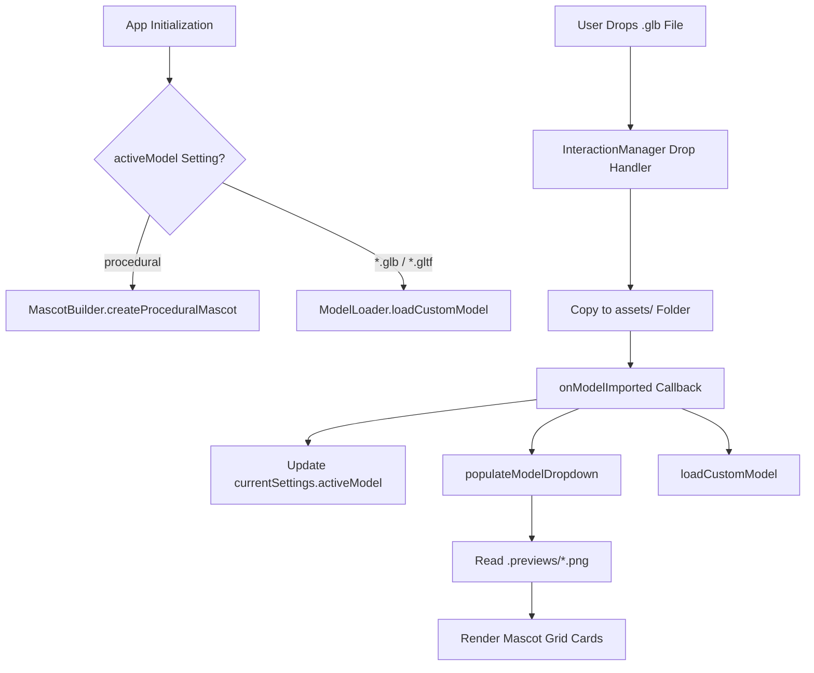

# 📋 Technical Diagnostic & Architectural Plan 001
## Subsystem: Default Hosted 3D Mascot Model, Asset Ingestion & Preview Viewport Synchronization

---

## 1. Executive Summary & Problem Diagnosis

### 1.1 Context
Desktop Pet supports two categories of 3D mascot assets:
1. **Default Hosted Procedural Mascot (`procedural`)**: A built-in, code-generated 3D character constructed via Three.js primitives (`src/core/MascotBuilder.js`) with glossy physical clay/vinyl shaders, facial features, blush cheeks, ears, and collision bounds.
2. **User-Imported Custom GLB/GLTF Models (`*.glb`, `*.gltf`)**: Arbitrary external 3D meshes imported via drag-and-drop or placed directly into the `assets/` directory.

### 1.2 Identified Issues & Root Cause Analysis

#### 🚩 Issue A: Incorrect Display Label ("Pink Bunny" vs. "Default")
- **Observed Behavior**: In the Settings Panel (*Display & Model* tab), the default hosted mascot selection card displays the hardcoded English label `"Pink Bunny"` rather than `"Default"`.
- **Root Cause**: In [`src/ui/PreviewGenerator.js`](file:///c:/Users/space/.gemini/antigravity-ide/scratch/Desktop-3D-Display-T02%20V1/src/ui/PreviewGenerator.js#L86):
  ```javascript
  label.textContent = modelKey === 'procedural' ? 'Pink Bunny' : modelKey.replace(/\.(glb|gltf)$/i, '');
  ```
  This string is hardcoded, unlocalized, and violates internationalization standards across the 12 supported locales. It should simply be localized as `"Default"` (e.g. `t('default_mascot')` or `"Default"`).

---

#### 🚩 Issue B: Default Mascot Preview Thumbnail Corruption on GLB Import
- **Observed Behavior**: When a user drags and drops a new `.glb` file into the application window, the default mascot thumbnail card in the settings grid either displays a corrupt image, captures an incorrectly scaled frame of the newly imported GLB, or becomes distorted.
- **Root Cause Chain**:
  1. **Active Scene Snapshot Contamination**: In [`src/ui/PreviewGenerator.js`](file:///c:/Users/space/.gemini/antigravity-ide/scratch/Desktop-3D-Display-T02%20V1/src/ui/PreviewGenerator.js#L13-L44) (`generateModelPreview`), thumbnails are captured directly from the live `renderer.domElement` (`renderer.render(scene, camera)`). If `generateModelPreview('procedural')` executes when a custom model is loaded or being loaded, it captures the current screen contents instead of the true procedural mascot.
  2. **Camera State & Bounding Box Overwrite**: When a custom model is imported via [`loadCustomModel`](file:///c:/Users/space/.gemini/antigravity-ide/scratch/Desktop-3D-Display-T02%20V1/src/core/ModelLoader.js#L123-L244), the main `camera.position`, `camera.aspect`, and FOV distance are dynamically adjusted to fit the custom model's bounding box. Any background or foreground snapshot of the procedural model taken without resetting to standard camera parameters results in misframed or distorted output.
  3. **Discrepancy in Background Preview Mesh**: In [`src/ui/PreviewGenerator.js`](file:///c:/Users/space/.gemini/antigravity-ide/scratch/Desktop-3D-Display-T02%20V1/src/ui/PreviewGenerator.js#L178-L217) (`generateMascotPreviewInBackground`), the procedural thumbnail generator builds a makeshift, simplified geometry rather than invoking [`createProceduralMascot`](file:///c:/Users/space/.gemini/antigravity-ide/scratch/Desktop-3D-Display-T02%20V1/src/core/MascotBuilder.js#L13) from `MascotBuilder.js`. This creates a visual mismatch between the background-generated thumbnail and the actual on-screen default mascot.

---

#### 🚩 Issue C: Broken Fallback Thumbnail Asset Reference
- **Observed Behavior**: When `.previews/procedural.png` does not yet exist on disk, the UI attempts to load `./assets/bunny_icon.png`:
  ```javascript
  img.src = './assets/bunny_icon.png';
  ```
- **Root Cause**: `assets/bunny_icon.png` is not present in the workspace root or runtime asset directory, causing a broken image icon (HTTP 404 / file not found) until a PNG snapshot is generated.

---

## 2. Architecture & Data Flow Overview

### 2.1 Model Discovery & Selection Lifecycle


### 2.2 Preview Thumbnail Generation Matrix
| Model Key | Generation Function | Target File | Isolation Level | Current Status |
| :--- | :--- | :--- | :--- | :--- |
| `procedural` | `generateModelPreview` / `generateMascotPreviewInBackground` | `assets/.previews/procedural.png` | Shared Scene / Camera | ⚠️ High Risk (Captures active custom model or uses incorrect mock mesh) |
| `*.glb` | `loadCustomModel` -> `generateModelPreview` | `assets/.previews/<model>.png` | Active Scene Frame | ⚠️ Medium Risk (Subject to window aspect ratio changes) |

---

## 3. Targeted Remediation Plan

### 3.1 Localization & Naming Standard
1. **Locale Key Addition**: Add `"default_mascot": "Default"` (and translated equivalents) across all 12 supported locales in `scratch_create_locales.js` and `locales/*/translation.json`.
2. **UI Label Update**: In `src/ui/PreviewGenerator.js` (`populateModelDropdown`), display `t ? t('default_mascot') : 'Default'` when `modelKey === 'procedural'`.

### 3.2 Isolated Default Model Preview Pipeline
1. **Dedicated Procedural Preview Capture**:
   - Refactor `generateMascotPreviewInBackground` so that for `procedural`, it directly uses `createProceduralMascot` inside an isolated temporary Three.js scene/camera setup with canonical camera framing (`fov: 45`, `aspect: 1.0`, `position: (0, 0, 5.5)`) and neutral studio lighting.
   - Ensure the live scene and active custom model are never mutated or visually polluted during default preview generation.
2. **Immediate Generation on App Startup**:
   - If `assets/.previews/procedural.png` is absent on boot, immediately render and cache the canonical default thumbnail before loading custom assets.

### 3.3 Safe Fallback Icon
1. Replace the missing `./assets/bunny_icon.png` reference with an inline SVG Data-URI or generate a default placeholder asset to guarantee that no broken image links occur.

### 3.4 Model Import State Cleanliness
1. In `InteractionManager.js` (`onModelImported`), ensure that after saving the new GLB and populating the model dropdown, the default mascot thumbnail remains anchored to `assets/.previews/procedural.png` without being overwritten by the new model's render pass.

---

## 4. Verification & Testing Strategy

1. **Automated Unit Tests**:
   - Verify `SettingsManager` defaults still resolve `activeModel: "procedural"`.
   - Validate that `scanForModels` discovers both procedural and imported assets cleanly.
2. **Manual Regression & Diagnostic Verification**:
   - Launch app in clean state (no `.previews` folder). Verify default mascot thumbnail generates cleanly and displays the label `"Default"`.
   - Drag and drop a new `.glb` file. Verify:
     - The new model loads in the primary viewport.
     - The Settings Panel displays both the `"Default"` card with its proper pink mascot thumbnail and the new GLB card with its own generated thumbnail.
     - Switching between `"Default"` and custom models preserves both thumbnails and loads the correct geometry.
   - Run `node scratch_create_locales.js` to ensure 100% key parity across all 12 languages.
